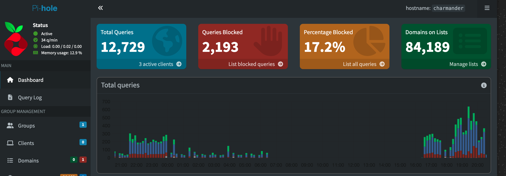
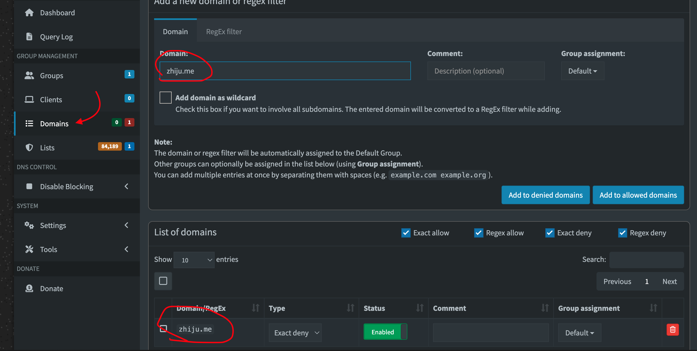
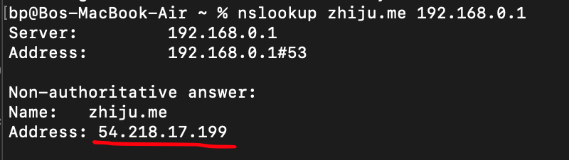
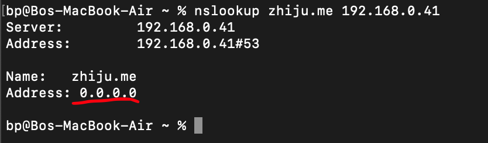

>Here I walk you through the demo
### Intro
1. open up pihole admin page 
2. show three pages (dashboard, query log and Domains)

### How do we stop mallicious domain? 
1. pick a mallicious domain (zhiju.me)
2. open it before blocking
3. add the domain to the denied list
4. try open it up again

### what is it doing under the hood? 
1. open terminal
2. query the doamin with default server

3. query the domain with pihole

4. notice it return 0.0.0.0 (a way pihole says "I don't know")

### Bonus
1. **It blocks ads!** Like… _a lot_ of ads.
2. Switch your DNS back to the default.
3. Open a GeeksforGeeks page and witness the absolute chaos — banners, pop-ups, and enough clutter to give your eyes a migraine.
4. Now switch back to Pi-hole.
5. Refresh GeeksforGeeks and admire the sudden _zen-like cleanliness_.