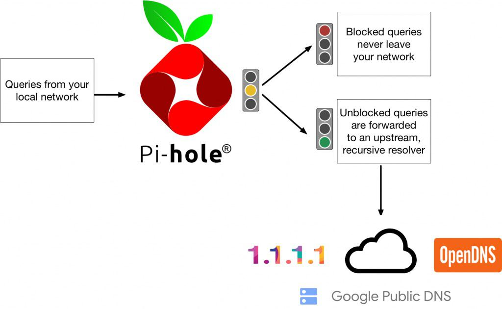

### The guy you talk first 
Imagine putting a little filter between your device and the DNS server. Every time you make a DNS request, that filter a.k.a. Pi-hole stops it and goes, “Hold on… is this domain actually safe?”

If it is, Pi-hole waves it through like a friendly bouncer.  
If it’s shady, Pi-hole just shrugs and says, “Yeah… I don’t know that one 🤷‍♂️”  
and blocks it right there.

### overview

